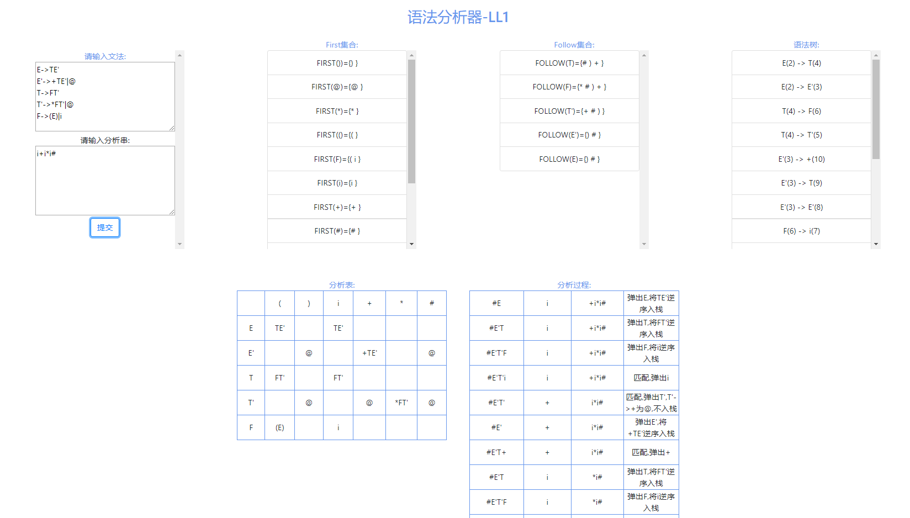

# Simple Compiler
[](https://travis-ci.org/Chasiny/simple_compiler)

## Run
```bash
go get github.com/Chasiny/simple_compiler
cd $GOPATH/src/github.com/Chasiny/simple_compiler
go run main.go
```


## Lexical analysis

prase regexp to nfa, and convert nfa to dfa,   
input the program and output its words.   
The effect is as follows:


## Grammar analysis
input the grammar and generate the fisrt set,follow set and grammar tree,  
input the analysis string and output the analysis process.  
The effect is as follows:



## Simple compiler
using int dfa, and simple four arithmetic grammars,   
input a simple program and output is all variables value.   
The effect is as follows:

